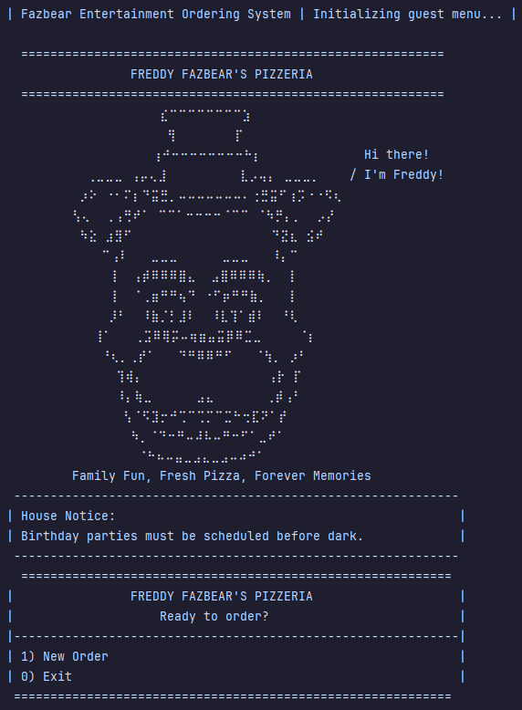

# Freddy Fazbear's Pizzeria Ordering App 🍕🎈🐻

---
## Description 🐥

---
Freddy Fazbear's Pizzeria Ordering App is a Java text-based pizza ordering system for a custom pizza shop. Customers can build custom pizzas, order signature pizzas, add drinks and garlic knots, remove items, review their order at checkout, and save a receipt file.

## Inspiration 🐰

---

For this project, I wanted to imagine what a pizza ordering app might feel like if it existed in the 80s inside the world of Freddy Fazbear's Pizzeria.

I chose a Five Nights at Freddy's theme because my little cousins and my sister love the game and movie. It was also one of the last movies we watched together before I came to the United States, so I wanted to build something fun that reminded me of them.

The goal was not just to make a normal pizza ordering system. I wanted the app to feel slightly haunted, like the ordering system is old, strange, and maybe knows a little too much. 


---
## Favorite Part of the Project

One part of this project that I am honestly proud of is the theme and atmosphere.

Instead of making a plain pizza ordering system, I wanted the app to feel like it belonged inside an old 1980s Freddy Fazbear's Pizzeria computer system. I added small print messages, loading text, house notices, receipt messages, and closing lines that make the app feel a little unsettling, like the system knows more than it should.

For example, some messages are playful at first, but slightly strange or creepy if the user pays attention. This helped make the console app feel more immersive instead of just being a basic menu program. 

I am proud of this because it gave the project personality while still meeting the main requirements of the pizza ordering application.
```java
private void closingScreen() {
System.out.println("""
-----------------------------------------------------------
|        THANK YOU FOR USING FREDDY FAZBEAR'S APP           |
|========================================================== |
|                                                           |
| Freddy Fazbear's Pizzeria is not responsible for:         |
| missing items, missing time, missing children,            |
| unusual dreams, moving animatronics,                      |
| singing from vents, duplicate family members,             |
| or memories recovered during dessert.                     |
|                                                           |
| Thank you for dining with us.                             |
|                                                           |
|              - Freddy, Chica, Bonnie, Foxy                |
===========================================================
""");

        System.out.println("Please come again.");
        pause(1200);

        System.out.println("You. Always. Do.");

        pause(500);

    }
```

---

## Features 🫧

---

- Start a new order from the home screen
- Build your own pizza
- Choose pizza size, crust, stuffed crust, toppings, and sauce
- Add premium meat and cheese toppings with extra options
- Add regular toppings
- Add drinks with size and flavor
- Add garlic knots with quantity
- Remove items from the order
- Review order details at checkout
- Save receipt files to a `receipts` folder
- Input validation for invalid menu choices
- Themed Freddy Fazbear console UI

## Bonus Features 🦊

---
- Signature pizzas
- Customize signature pizzas by adding or removing toppings
- Duplicate topping prevention
- Receipt printing animation
- Themed loading and closing screens
-----------------
## Project Structure 🥤

---
```text
src/main/java/com/fazbears
├── Program.java
├── data
│   └── ReceiptManager.java
├── model
│   ├── Product.java
│   ├── Order.java
│   ├── Pizza.java
│   ├── Topping.java
│   ├── Meat.java
│   ├── Cheese.java
│   ├── RegularTopping.java
│   ├── Drink.java
│   ├── GarlicKnots.java
│   ├── FreddysClassicPartyPizza.java
│   ├── ChicasKitchenFeast.java
│   └── GoldenFreddysAfterHoursSpecial.java
└── ui
    └── UserInterface.java
```
---------------

## Class Diagram

---


---

## How to Run 🎈

---
1. Clone the repository
2. Open the project in IntelliJ IDEA
3. Run Program.java
4. Follow the console menu prompts
------------------
## Future Improvements 🍕

---
- Add more JUnit tests
- Add color highlighting to menu titles
- Improve receipt formatting
- Add customer names
- Add saved order history
- Refactor UI printing into a separate Menu Class
-----------------
## AI Use Statement 💻

---
After I got my project working,I used Claude as a support tool for debugging, refactoring ideas, README polish, and learning guidance. I used it to review my code, think through edge cases, and improve the readability of the project.

The project theme, implementation choices, final code, and testing decisions were completed and reviewed by me.
- Asking for feedback on menu flow and user experience
- Getting refactoring suggestions for cleaner methods
- Reviewing how to prevent duplicate toppings
- Improving README wording and project explanation
- Thinking through what to test with JUnit

#### AI was used more like a tutor or code review partner, not as a replacement for building the project myself.

----

## Author 
##### Beatriz Jardim